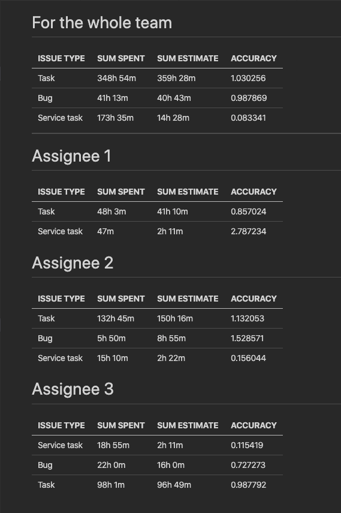

# SpentTimeAnalytics

This pipeline provides possibility to find out:
- How many time we've already spent for each issue type (like for Bugs, Tasks) for specific time interval (like for s sprint or for an epic)
- Hos many time each team member spent

The result of this pipeline:

```
FOR THE WHOLE TEAM
+--------------+-----------+--------------+----------+
|  ISSUE TYPE  | SUM SPENT | SUM ESTIMATE | ACCURACY |
+--------------+-----------+--------------+----------+
| Bug          | 41h 13m   | 40h 43m      | 0.987869 |
| Service task | 173h 35m  | 14h 28m      | 0.083341 |
| Task         | 348h 54m  | 359h 28m     | 1.030256 |
+--------------+-----------+--------------+----------+

***************************************************

Assignee 1
+--------------+-----------+--------------+----------+
|  ISSUE TYPE  | SUM SPENT | SUM ESTIMATE | ACCURACY |
+--------------+-----------+--------------+----------+
| Service task | 47m       | 2h 11m       | 2.787234 |
| Task         | 48h 3m    | 41h 10m      | 0.857024 |
+--------------+-----------+--------------+----------+

Assignee 2
+--------------+-----------+--------------+----------+
|  ISSUE TYPE  | SUM SPENT | SUM ESTIMATE | ACCURACY |
+--------------+-----------+--------------+----------+
| Task         | 132h 45m  | 150h 16m     | 1.132053 |
| Bug          | 5h 50m    | 8h 55m       | 1.528571 |
| Service task | 15h 10m   | 2h 22m       | 0.156044 |
+--------------+-----------+--------------+----------+

Assignee 3
+--------------+-----------+--------------+----------+
|  ISSUE TYPE  | SUM SPENT | SUM ESTIMATE | ACCURACY |
+--------------+-----------+--------------+----------+
| Bug          | 22h 0m    | 16h 0m       | 0.727273 |
| Task         | 98h 1m    | 96h 49m      | 0.987792 |
| Service task | 18h 55m   | 2h 11m       | 0.115419 |
+--------------+-----------+--------------+----------+
...
```

Or in Markdown


## Args

FistArg: `sta`

RequiredFlags:
- projid - This is a jira project ID (like SPL-100)
- board - This is a project board (like iOS)

OptionalFlags:
- sprint - This is a project sprint. You can pass sprint name ("SPL iOS 01 Init") or id (123)
- epic - This is a project epic. You can pass just a name ("SPL-IOS Infrastructure") or id (SPL-1)
- mrkdown - If set then format output as markdown
